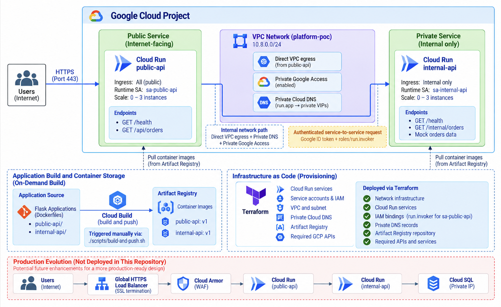

# GCP Platform Modernization with Cloud Run & Terraform

A containerized application modernization architecture designed and implemented on Google Cloud, demonstrating managed serverless containers, secure public-to-private service communication, identity-based authorization, private networking, and reproducible infrastructure with Terraform.



## Solution Overview

This project demonstrates the modernization of a small containerized application into a managed Google Cloud architecture using **Cloud Run**.

The application is separated into two services with distinct trust boundaries. An internet-facing `public-api` receives client requests, while an `internal-api` provides backend order data through internal-only Cloud Run ingress.

Communication between the services is protected through both **network and identity controls**. The public service uses Direct VPC egress, Private Google Access, and private Cloud DNS to reach the internal Cloud Run service through an accepted internal path. At the identity layer, `public-api` obtains a Google identity token for the internal service, and IAM grants its service account `roles/run.invoker` specifically on `internal-api`.

Both applications are packaged as Docker containers. Cloud Build is invoked on demand through a repository script to build the images and push them to Artifact Registry. Terraform manages the GCP infrastructure, including Cloud Run, IAM and service accounts, Artifact Registry, VPC networking, private DNS, and required Google Cloud APIs.

The services are configured to scale to zero when idle and scale out to a maximum of three instances, keeping the portfolio environment cost-conscious while demonstrating a managed serverless application model.

---

## Architecture Highlights

- **Managed application modernization** — two containerized Flask services run on Cloud Run rather than requiring application VMs or Kubernetes cluster management.
- **Public and private service separation** — `public-api` accepts internet traffic while `internal-api` uses internal-only Cloud Run ingress.
- **Private service connectivity** — Direct VPC egress, Private Google Access, and private Cloud DNS provide the network path from the public service to the internal Cloud Run service.
- **Identity-based service authorization** — `public-api` authenticates with a Google identity token, and its dedicated service account is granted `roles/run.invoker` specifically on `internal-api`.
- **Workload identity separation** — the public and internal services run under separate service accounts rather than sharing a runtime identity.
- **Infrastructure as Code** — Terraform manages the application platform, networking, IAM, Artifact Registry, private DNS, and required APIs.
- **Managed container delivery** — Cloud Build performs on-demand container builds and pushes versioned images to Artifact Registry.
- **Cost-aware serverless scaling** — both Cloud Run services can scale to zero when idle and scale out to a configured maximum of three instances.
- **Production evolution path** — the architecture identifies Global HTTPS Load Balancing, Cloud Armor, and Cloud SQL with private connectivity as planned enhancements rather than currently deployed resources.

---

## Architecture Walkthrough

### Application Services

The application consists of two Python/Flask services deployed independently to Cloud Run.

| Service | Purpose | Exposure |
| --- | --- | --- |
| `public-api` | Internet-facing application entry point | Public Cloud Run ingress |
| `internal-api` | Backend service providing mock order data | Internal Cloud Run ingress only |

Both services use:

- Python 3.12
- Flask
- Gunicorn
- Docker
- Cloud Run

Each service is configured with:

```text
Minimum instances: 0
Maximum instances: 3
CPU: 1
Memory: 512 MiB
```

Scaling to zero reduces idle compute usage in the portfolio environment, while Cloud Run manages instance creation as request demand increases.

---

## Public API

`public-api` is the application's external entry point.

It exposes:

```text
GET /health
GET /api/orders
```

Cloud Run is configured with:

```text
Ingress: All
Runtime service account: sa-public-api
```

For this portfolio PoC, unauthenticated invocation of the public service is enabled by default so the application can be tested directly over HTTPS.

This setting applies only to `public-api`. The internal service remains protected by internal ingress and IAM authorization.

When a user calls:

```text
GET /api/orders
```

the public service calls `internal-api` to retrieve the underlying order data.

---

## Internal API

`internal-api` represents the application's private backend service.

It exposes:

```text
GET /health
GET /internal/orders
```

Cloud Run is configured with:

```text
Ingress: Internal only
Runtime service account: sa-internal-api
```

The service returns a small mock order dataset stored in the application code.

No database is deployed in the current implementation.

Unlike the public service, `internal-api` does not grant invocation permission to `allUsers`.

Only the `public-api` runtime identity receives permission to invoke it.

---

## Private Service Connectivity

Protecting `internal-api` requires more than IAM authorization.

The service uses:

```text
INGRESS_TRAFFIC_INTERNAL_ONLY
```

so the request from `public-api` must also arrive through an accepted internal network path.

Terraform creates a custom VPC:

```text
VPC: platform-poc
Subnet: 10.8.0.0/24
```

Private Google Access is enabled on the subnet.

`public-api` uses **Direct VPC egress** with:

```text
PRIVATE_RANGES_ONLY
```

This provides Cloud Run with VPC connectivity without deploying a Serverless VPC Access connector.

### Private Cloud DNS

Terraform also creates a private Cloud DNS zone for:

```text
run.app
```

Within the VPC, Cloud Run hostnames resolve to Google's `private.googleapis.com` VIP range:

```text
199.36.153.8
199.36.153.9
199.36.153.10
199.36.153.11
```

The resulting service path is:

```text
public-api
     |
     | Direct VPC egress
     v
platform-poc VPC
     |
     | Private Cloud DNS
     | Private Google Access
     v
Google private API path
     |
     v
internal-api
```

This network path allows the request to satisfy the internal ingress policy on `internal-api`.

---

## Service-to-Service Authentication

Network connectivity alone does not authorize `public-api` to invoke the internal service.

Each Cloud Run service receives a separate runtime service account:

```text
sa-public-api
sa-internal-api
```

Terraform grants:

```text
sa-public-api
      |
      | roles/run.invoker
      v
internal-api
```

No equivalent public invocation permission is granted to `internal-api`.

When `/api/orders` receives a request, `public-api` obtains a Google identity token using the internal service URI as the token audience.

The application then sends:

```text
Authorization: Bearer <identity-token>
```

when requesting:

```text
/internal/orders
```

Cloud Run validates the caller identity and IAM authorization before allowing invocation.

The design therefore applies two separate controls:

```text
NETWORK CONTROL
Internal-only ingress
        +
Direct VPC egress
Private Cloud DNS
Private Google Access

        AND

IDENTITY CONTROL
Google identity token
        +
roles/run.invoker
```

This avoids using a shared static API key between the application services.

---

## Security Design

Security controls implemented in the architecture include:

- `internal-api` uses internal-only Cloud Run ingress.
- `public-api` and `internal-api` use separate runtime service accounts.
- `internal-api` does not grant invocation access to `allUsers`.
- Only `sa-public-api` receives `roles/run.invoker` on `internal-api`.
- Service-to-service authentication uses Google identity tokens rather than a shared application credential.
- The identity token audience is scoped to the internal Cloud Run service URI.
- Direct VPC egress provides VPC connectivity for the public service.
- Private Google Access is enabled on the application subnet.
- Private Cloud DNS resolves Cloud Run traffic through Google's private API VIP range.
- Infrastructure configuration is managed through Terraform rather than manual console configuration.
- No application API keys or service account keys are required for service-to-service communication.

The public Cloud Run endpoint intentionally allows unauthenticated invocation by default for portfolio demonstration purposes. A production application would determine its external authentication model based on application and user requirements.

---

## Container Build and Artifact Management

Both applications include independent Dockerfiles and are stored as separate container images:

```text
public-api:v1
internal-api:v1
```

Images are stored in the Terraform-managed Artifact Registry repository:

```text
platform
```

The build workflow is intentionally on demand rather than a continuous deployment pipeline.

```text
Developer
    |
    | ./scripts/build-and-push.sh
    v
Cloud Build
    |
    | Build Docker images
    v
Artifact Registry
    |
    +-- public-api:v1
    |
    +-- internal-api:v1
```

The script invokes:

```text
gcloud builds submit
```

for each application.

Cloud Build provides the temporary managed build environment, while Artifact Registry provides persistent image storage.

This project uses Cloud Build for **on-demand container builds**; it does not currently implement an automated CI/CD pipeline or source-triggered Cloud Build workflow.

---

## Infrastructure as Code

Terraform manages the core GCP infrastructure.

The configuration includes:

- Required Google Cloud APIs
- Artifact Registry
- Runtime service accounts
- IAM service invocation permissions
- VPC network
- Application subnet
- Private Google Access
- Private Cloud DNS
- Public Cloud Run service
- Internal Cloud Run service

Artifact Registry is owned by Terraform rather than being independently created by the build script.

The deployment sequence therefore separates infrastructure ownership from application image building.

```text
Terraform
    |
    v
Artifact Registry
    |
    v
Cloud Build
build + push images
    |
    v
Terraform
    |
    v
Cloud Run + networking + IAM
```

The initial targeted Terraform apply bootstraps Artifact Registry because the Cloud Run resources reference container images that must exist before the complete application deployment.

For a larger production platform, foundational infrastructure and application deployment could instead be separated into independent Terraform configurations or orchestrated through a CI/CD workflow.

---

## Key Architecture Decisions

This project focuses on the architectural decisions involved in moving a small containerized application to managed cloud services while preserving a meaningful security boundary.

| Design Decision | Rationale |
| --- | --- |
| Cloud Run instead of application VMs | Removes VM operating-system and application-server management for request-driven container services |
| Cloud Run instead of GKE | Avoids introducing Kubernetes cluster management where the application does not require cluster-level capabilities |
| Separate public and internal services | Establishes an explicit trust boundary between internet-facing and backend application functionality |
| Internal-only ingress | Prevents the backend service from accepting normal external ingress |
| Direct VPC egress | Provides Cloud Run VPC connectivity without a Serverless VPC Access connector |
| Private Cloud DNS | Routes Cloud Run service resolution through Google's private API address range inside the VPC |
| Private Google Access | Allows the subnet to reach supported Google services through the private path |
| Separate runtime service accounts | Gives each service an independent workload identity |
| Scoped `roles/run.invoker` | Authorizes only the public service identity to invoke the internal service |
| Google identity tokens | Provides workload-to-workload authentication without static API credentials |
| Scale to zero | Reduces idle compute cost for a portfolio environment |
| Terraform-managed infrastructure | Makes the cloud architecture reproducible and keeps infrastructure ownership explicit |
| On-demand Cloud Build | Provides managed container builds without adding a CI/CD platform that the PoC does not require |
| Mock application data | Keeps the current project focused on platform modernization and service security rather than database implementation |

---

## Cloud Run vs. GKE

Cloud Run was selected because the application consists of small HTTP services that fit a request-driven serverless container model.

The project does not require capabilities such as:

- Kubernetes cluster administration
- Custom pod scheduling
- Kubernetes networking policies
- Service mesh configuration
- Stateful Kubernetes workloads
- Cluster-level extensions

Introducing GKE would therefore add operational complexity without materially improving the current application architecture.

For workloads requiring greater control over container orchestration, Kubernetes networking, sidecars, cluster-level policies, or long-running non-request workloads, GKE could be evaluated instead.

---

## Portfolio / Lab Tradeoffs

This project is a portfolio PoC designed to demonstrate application modernization, Cloud Run networking, workload identity, IAM authorization, and Infrastructure as Code without maintaining unnecessary always-on infrastructure.

Some implementation choices intentionally prioritize architectural demonstration, cost, and repeatable deployment over production completeness:

- `public-api` allows unauthenticated invocation by default for straightforward application testing.
- Both Cloud Run services use a minimum instance count of zero, so cold starts are possible.
- Application data is mocked in the internal service rather than persisted in a managed database.
- Container builds are manually initiated rather than triggered through CI/CD.
- The architecture does not currently deploy a dedicated external HTTPS load balancer.
- Cloud Armor is not deployed.
- Cloud SQL is not deployed.
- The project is deployed as a single portfolio environment rather than through development, staging, and production promotion.

These are not intended as production defaults.

---

## Production Evolution

The architecture diagram includes a separate **Production Evolution** path that is explicitly **not deployed in this repository**.

Potential production-oriented additions include:

```text
Users
  |
  v
Global HTTPS Load Balancer
  |
  v
Cloud Armor
  |
  v
public-api
  |
  v
internal-api
  |
  v
Cloud SQL
Private IP
```

A production implementation would require additional design decisions around application authentication, database credentials, high availability, backup and recovery, edge security policies, observability, environment separation, and deployment automation.

These resources remain outside the current implementation so the repository does not imply capabilities that have not been built.

---

## Repository Structure

```text
.
├── README.md
├── architecture.png
│
├── apps/
│   ├── public-api/
│   │   ├── app.py
│   │   ├── Dockerfile
│   │   └── requirements.txt
│   │
│   └── internal-api/
│       ├── app.py
│       ├── Dockerfile
│       └── requirements.txt
│
├── scripts/
│   ├── build-and-push.sh
│   ├── gcp-budget-alerts.sh
│   └── gcp-day0-setup.sh
│
└── terraform/
    ├── apis.tf
    ├── artifact_registry.tf
    ├── cloud_run_internal.tf
    ├── cloud_run_public.tf
    ├── outputs.tf
    ├── providers.tf
    ├── service_accounts.tf
    ├── terraform.tfvars.example
    ├── variables.tf
    ├── versions.tf
    └── vpc.tf
```

---

## Deployment

### Prerequisites

- Google Cloud project with billing enabled
- Google Cloud CLI
- Terraform ≥ 1.5
- Application Default Credentials configured for Terraform
- Docker application source included in this repository

Authenticate:

```bash
gcloud auth login
gcloud auth application-default login
```

Configure the target project and region:

```bash
export PROJECT_ID="your-gcp-project-id"
export REGION="us-central1"

gcloud config set project "${PROJECT_ID}"
gcloud config set compute/region "${REGION}"
```

### 1. Configure Terraform

```bash
cd terraform

cp terraform.tfvars.example terraform.tfvars
```

Set the target project:

```hcl
project_id = "your-gcp-project-id"
region     = "us-central1"
```

Initialize Terraform:

```bash
terraform init
```

### 2. Bootstrap Artifact Registry

Cloud Run references the application container images, so Artifact Registry is created before the initial image build:

```bash
terraform apply \
  -target=google_artifact_registry_repository.platform
```

Artifact Registry remains Terraform-managed.

### 3. Build and Push the Containers

From the repository root:

```bash
cd ..
./scripts/build-and-push.sh
```

Cloud Build creates:

```text
us-central1-docker.pkg.dev/<project-id>/platform/public-api:v1
us-central1-docker.pkg.dev/<project-id>/platform/internal-api:v1
```

### 4. Deploy the Architecture

```bash
cd terraform
terraform apply
```

Terraform deploys the remaining application infrastructure and Cloud Run services.

---

## Validation

Retrieve the public URL:

```bash
PUBLIC_URL="$(terraform output -raw public_url)"
```

Test the public service:

```bash
curl -sS "${PUBLIC_URL}/health"
```

Test the end-to-end request path:

```bash
curl -sS "${PUBLIC_URL}/api/orders" | python3 -m json.tool
```

The expected request flow is:

```text
User
  |
  | HTTPS
  v
public-api
  |
  | Google identity token
  | Direct VPC/private Google path
  v
internal-api
  |
  v
Mock order data
```

### Validate the IAM Boundary

Remove the public service's invocation permission from `internal-api`:

```bash
gcloud run services remove-iam-policy-binding internal-api \
  --region=us-central1 \
  --member="serviceAccount:sa-public-api@${PROJECT_ID}.iam.gserviceaccount.com" \
  --role="roles/run.invoker"
```

Calling:

```bash
curl -sS "${PUBLIC_URL}/api/orders"
```

should no longer successfully retrieve the internal orders.

Restore the Terraform-managed IAM configuration:

```bash
terraform apply
```

A successful request after restoration confirms that service-to-service access depends on the intended workload identity and IAM permission.

---

## Cost Management

Both Cloud Run services use:

```text
min_instance_count = 0
```

so application compute can scale to zero while idle.

The repository also includes:

```text
scripts/gcp-budget-alerts.sh
```

for configuring budget notifications in a lab environment.

The planned Global HTTPS Load Balancer, Cloud Armor, and Cloud SQL resources are not deployed and therefore do not contribute to the current architecture's runtime cost.

---

## Destroy / Cleanup

The Terraform-managed infrastructure can be removed when the portfolio environment is not being used:

```bash
cd terraform
terraform destroy
```

Container images stored in Artifact Registry are also managed within the Terraform-created repository and are removed when that repository is destroyed.

Budget configuration created separately through `gcp-budget-alerts.sh` is outside the Terraform application stack and should be reviewed separately if complete project cleanup is required.

---

## Future Improvements

Planned production-oriented enhancements include:

- Add a Global HTTPS Load Balancer in front of the public Cloud Run service.
- Add Cloud Armor for edge security controls.
- Add Cloud SQL using private connectivity for persistent application data.
- Add automated CI/CD for container builds and infrastructure deployment.
- Add development and staging environments with controlled promotion.
- Add application-level authentication for external users where required.
- Expand logging, alerting, dashboards, and service-level monitoring.
- Evaluate minimum Cloud Run instances where latency requirements justify avoiding cold starts.
- Add automated application and infrastructure validation to the deployment workflow.

---

## Author

**Beatriz Johnson**

Cloud architecture portfolio project focused on **application modernization, serverless containers, private service connectivity, workload identity, IAM authorization, Infrastructure as Code, and cost-aware platform design on Google Cloud**.