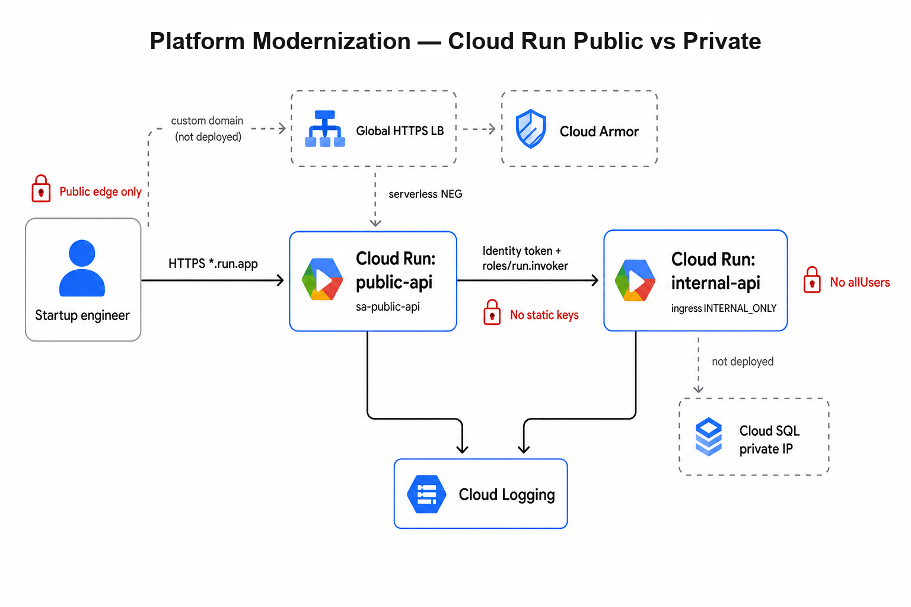

# Platform Modernization — Public vs Private on Cloud Run

**What this is:** A portfolio PoC that modernizes a classic pattern — **Docker Compose on a VM** — onto **Google Cloud Run**, with a clear **public vs private** split enforced by platform controls (not hope-based networking or a shared API key).

**Who it’s for:** Demonstrates how to move containers to the cloud while defining **who can reach what**: a public edge API, an internal data-tier API, identity-based auth between them, and reproducible infrastructure as code. Cost stays workshop-friendly (scale-to-zero; no live load balancer / WAF / managed DB in this PoC).

| | |
|---|---|
| **Problem** | Lifting VMs into the cloud without a clear public/private boundary |
| **Approach** | Public API + internal-only API + IAM invoker + service-to-service identity tokens |
| **Outcome** | Wrong IAM → public `/api/orders` returns **403** (networking *and* identity matter) |

### Built with

| Area | Technologies |
|------|----------------|
| **Services** | Python / Flask (`public-api`, `internal-api`) |
| **Runtime** | Google Cloud Run (public HTTPS + internal ingress) |
| **Auth** | Service accounts, identity tokens, IAM `roles/run.invoker` |
| **Networking** | Internal-only ingress, Direct VPC egress, private DNS |
| **Infra as code** | Terraform |
| **Delivery** | Docker, Artifact Registry |

**Skills shown:** Cloud Run · IAM / service accounts · service-to-service auth · public vs private ingress · Terraform · Artifact Registry · cost-aware platform design · Cloud Run vs GKE judgment



---

## Why this exists

Teams modernizing off a single VM often lift containers into the cloud without defining who can reach what. “Internal” becomes hope-based networking or a shared static key.

This repo proves a different default:

| Constraint | What this repo does |
|------------|---------------------|
| Public edge, private data tier | `public-api` on `*.run.app`; `internal-api` with `INGRESS_TRAFFIC_INTERNAL_ONLY` |
| No static API keys between services | Google **identity token** (audience = internal URI) |
| Who can call whom is explicit | Only `sa-public-api` has `roles/run.invoker` on `internal-api` |
| Reproducible, not click-ops | Full stack in **Terraform** |
| Don’t burn credits on unused edge | Global HTTPS LB / Armor / SQL stay **off** until production |

Wrong IAM → public `/api/orders` returns **403**. That failure mode is intentional — networking and identity both matter.

---

## What you’ll find in the code

| Layer | Implementation |
|-------|----------------|
| **Edge** | Flask `public-api` — public HTTPS, workshop default allows unauthenticated invoke |
| **Internal** | Flask `internal-api` — mock orders JSON; not reachable from the public internet |
| **Authn** | Public SA mints an identity token and calls internal with `Authorization: Bearer …` |
| **Authz** | IAM `roles/run.invoker` on `internal-api` for `sa-public-api` only |
| **Networking** | Direct VPC egress + private DNS so peer Cloud Run calls classify as internal |
| **IaC** | Terraform: APIs, Artifact Registry, service accounts, Cloud Run pair, VPC |

---

## Architecture

**Live path**

1. Caller → HTTPS `*.run.app` → **public-api**
2. **public-api** fetches an identity token (audience = internal URI) via the metadata server
3. Call → **internal-api** with `roles/run.invoker` for `sa-public-api` only
4. Both services → Cloud Logging

**Production path (diagram dashed — not deployed)**

- Global HTTPS Load Balancer + Cloud Armor in front of the edge
- Cloud SQL (private IP) behind the data tier
- Same identity model; richer edge controls and real persistence

| Service | Endpoints | Exposure |
|---------|-----------|----------|
| `public-api` | `GET /health`, `GET /api/orders` | Public HTTPS; optional `allUsers` invoker for demos |
| `internal-api` | `GET /health`, `GET /internal/orders` | Internal ingress only; IAM-locked |

**Cloud Run vs GKE:** Prefer Cloud Run for request-driven services and a fast modernization path. Choose GKE when you need a cluster platform, custom mesh/sidecars, or non-HTTP long-running workloads. This PoC stays on Cloud Run on purpose.

---

## Stack map

| Concept | Here | AWS analogue |
|---------|------|--------------|
| Managed containers | **Cloud Run** | App Runner / Fargate |
| Images | **Artifact Registry** | ECR |
| Who can invoke | Service accounts + `run.invoker` | Task roles / resource policies |
| IaC | Terraform `google` provider | Terraform AWS provider |

---

## Roadmap (not deployed beyond this PoC)

This repo ships only the public + internal Cloud Run path. Everything under **Next** and **Later** is a suggested production path — it is **not** included in this codebase or Terraform.

| Scope | Deployed here? | Focus |
|-------|----------------|-------|
| **This repo (PoC)** | Yes | Public + internal Cloud Run, identity tokens, internal ingress, Terraform, Logging |
| **Next** | No | Global HTTPS LB + custom domain, Cloud Armor, Cloud SQL private IP, CI/CD |
| **Later** | No | Min instances / SLOs, drop `allUsers` if the product needs auth, multi-env promotion |

Idle Global HTTPS LB often costs tens of USD/month with no traffic — that’s why it stays out of the PoC (and why those pieces are dashed in the architecture diagram).

---

## Repo layout

```text
ce-platform-modernization/
  README.md
  docs/architecture.png
  apps/
    public-api/       # Flask edge API
    internal-api/     # Flask orders API (internal)
  terraform/          # APIs, AR, SAs, Cloud Run, VPC egress
  scripts/
    gcp-day0-setup.sh
    gcp-budget-alerts.sh
    build-and-push.sh
```

---

## Prerequisites

- A GCP project with billing linked (Free Trial OK). Create one in the [Console](https://console.cloud.google.com/projectcreate) if you do not have a project yet.
- `gcloud` authenticated (`gcloud auth login` + `gcloud auth application-default login`)
- Terraform ≥ 1.5

---

## Configure your project

Examples in this README use `your-gcp-project-id`. Replace that with **your** project ID everywhere (CLI, scripts, and `terraform.tfvars`).

```bash
export PROJECT_ID="your-gcp-project-id"
export REGION="us-central1"

gcloud config set project "${PROJECT_ID}"
gcloud config set compute/region "${REGION}"
```

| Command | Purpose |
|---------|---------|
| `gcloud config set project …` | Default project for later `gcloud` commands |
| `gcloud config set compute/region …` | Default region (this PoC uses `us-central1`) |

Scripts (`build-and-push.sh`, `gcp-day0-setup.sh`, `gcp-budget-alerts.sh`) read `PROJECT_ID` / `REGION` from the environment. If unset, they fall back to the example project above.

### Optional helpers

**Day-0 setup** — link billing (if needed), enable required APIs, smoke-check Cloud Run. Skip if you prefer; Terraform `apply` also enables the APIs.

```bash
./scripts/gcp-day0-setup.sh
```

**Budget alerts** — recommended for workshops (~$10 / $50). Not required to deploy.

```bash
./scripts/gcp-budget-alerts.sh
```

---

## Deploy

### 1. Build and push images

```bash
./scripts/build-and-push.sh
```

Images:

```text
us-central1-docker.pkg.dev/your-gcp-project-id/platform/internal-api:v1
us-central1-docker.pkg.dev/your-gcp-project-id/platform/public-api:v1
```

### 2. Terraform apply

```bash
cd terraform
cp terraform.tfvars.example terraform.tfvars   # once; edit project_id if needed
terraform init
terraform apply
```

If Artifact Registry already exists from the build script:

```bash
terraform import google_artifact_registry_repository.platform \
  projects/your-gcp-project-id/locations/us-central1/repositories/platform
```

### 3. Try it

```bash
PUBLIC_URL="$(terraform output -raw public_url)"
curl -sS "${PUBLIC_URL}/health"
curl -sS "${PUBLIC_URL}/api/orders" | python3 -m json.tool
```

Expect `/api/orders` to wrap internal orders with `"source": "public-api"`.

**Auth mode:** `allow_unauthenticated_public = true` (default) grants `allUsers` on **public** only. Internal stays authenticated. Set `false` to require a caller identity token on the public URL.

### Prove the IAM boundary

Remove invoker → 403; restore → success:

```bash
gcloud run services remove-iam-policy-binding internal-api \
  --region=us-central1 \
  --member="serviceAccount:sa-public-api@your-gcp-project-id.iam.gserviceaccount.com" \
  --role="roles/run.invoker"

curl -sS "${PUBLIC_URL}/api/orders" | python3 -m json.tool   # expect 403

gcloud run services add-iam-policy-binding internal-api \
  --region=us-central1 \
  --member="serviceAccount:sa-public-api@your-gcp-project-id.iam.gserviceaccount.com" \
  --role="roles/run.invoker"

# or: cd terraform && terraform apply
```

---

## Troubleshooting (quick)

| Symptom | Likely cause |
|---------|--------------|
| `/api/orders` → 403 | Public SA missing `roles/run.invoker` on `internal-api` |
| `/api/orders` → 502 / auth errors | Wrong identity-token **audience** or `INTERNAL_SERVICE_URL` |
| Curl internal URL from laptop → 404 | Expected — internal ingress; use public `/api/orders` instead |
| First request slow | Cold start (`min_instance_count = 0`) |
| Public requires auth unexpectedly | `allow_unauthenticated_public = false` or `allUsers` removed |
| Image not found on apply | Run `./scripts/build-and-push.sh` first |

`INTERNAL_SERVICE_URL` must equal `terraform output -raw internal_uri` (no `/internal/orders` suffix — the app appends the path).

---

## Cost

| Resource | Light demos |
|----------|-------------|
| Cloud Run (both services, min = 0) | Free tier / trial credits |
| Artifact Registry | Pennies if you prune old tags |
| Logging / VPC egress DNS | Negligible at PoC scale |
| Global HTTPS LB / Cloud Armor / Cloud SQL | **$0 — not deployed** |

When idle:

```bash
cd terraform && terraform destroy
```

Images can stay in Artifact Registry.

---

## Verify before you show it

- [ ] `terraform apply` creates `public-api` and `internal-api`
- [ ] Public `/api/orders` returns internal orders
- [ ] Removing `run.invoker` breaks the call; restoring fixes it
- [ ] Budget alerts exist; billing is linked
- [ ] `terraform destroy` when you’re done
